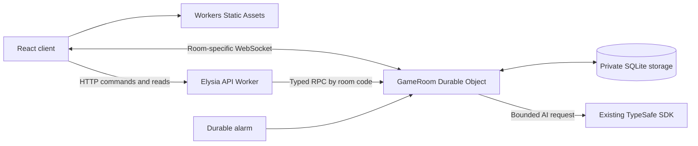

# Cloudflare Durable Objects integration plan

> Historical development record. Descriptions, test counts, and plans reflect the time of writing. See the [README](../../README.md) and [current Cloudflare guide](../cloudflare-deployment.md) for maintained instructions.

Status: historical design plan, based on source and live documentation checked on 2026-09-18. The implementation and current operational commands are documented in [Cloudflare deployment](../cloudflare-deployment.md). The implementation retains the existing Vite/PWA build and uses Wrangler Static Assets directly, without adding the Cloudflare Vite plugin.

## Recommended architecture

Host the React/Vite client with Workers Static Assets, keep Elysia/Eden for HTTP, and introduce one SQLite-backed `GameRoom` Durable Object per six-character room code. The object owns its room snapshot, seat authentication, game transitions, AI work, expiration, and WebSockets. Keep the current pure game engines and TypeSafe request builder.

Use the native Durable Objects APIs. The Cloudflare Agents SDK provides a broader agent runtime; our existing TypeSafe chooser needs a durable game coordinator rather than a new agent framework. No additional database, central room directory, Workflow, or queue is needed for this first migration. This is an application design choice; see the [Agents runtime overview](https://developers.cloudflare.com/agents/) for the alternative.



The Worker forwards the WebSocket upgrade to the same room object. It does not accept or proxy messages after the upgrade. Browser commands remain HTTP; WebSockets continue to deliver room views. This preserves the existing action/revision/error contract while changing the hosting model.

## Current source and migration boundaries

| Current location                                                    | Current responsibility                         | Planned change                                                                    |
| ------------------------------------------------------------------- | ---------------------------------------------- | --------------------------------------------------------------------------------- |
| `server/index.ts`                                                   | Bun listener, filesystem paths, static serving | New `server/worker.ts`; static assets handled by Cloudflare                       |
| `server/app.ts`, `server/rooms/routes.ts`                           | Elysia composition and HTTP schemas            | Separate HTTP app factory from Bun bootstrap; inject an asynchronous room gateway |
| `server/rooms/service.ts`                                           | All-room service, transitions, views, presence | Extract pure single-room transitions/views; execute them inside `GameRoom`        |
| `server/rooms/repository.ts`                                        | Global Map and whole-file JSON snapshots       | New per-object storage adapter with a versioned room envelope                     |
| `server/rooms/websocket.ts`                                         | Bun pub/sub, session Maps, auth timers         | Hibernating sockets handled by `GameRoom`                                         |
| `server/rooms/ai-turn.ts`                                           | Unbounded background AI chain                  | Durable, bounded AI steps with attempt state                                      |
| `server/ai.ts`, `server/ai-state.ts`                                | TypeSafe SDK, usage logging, legal choices     | Keep provider/model and behavior; inject Worker environment                       |
| `server/http/security.ts`                                           | Origin checks, local IP limiter, errors        | Worker body limits, binding-based limiter, explicit RPC error mapping             |
| `src/lib/api-client.ts`, `src/features/room/use-room-connection.ts` | Eden HTTP and subscriptions                    | Keep HTTP typing; add room-specific native WebSocket adapter                      |
| `shared/*`, presentation/cache code                                 | Rules, schemas, animation sequencing           | Preserve behavior; extend only transport/internal persistence types as needed     |

Current Flight rooms support two to four seats, including mixed human/AI players. A design hardcoded to two sockets or two players would break the app. Each AI roll and move is currently persisted and broadcast separately; the presentation queue relies on those intermediate revisions.

## 1. Tooling and first compatibility gate

Add Wrangler, the Cloudflare Vite plugin, and a separate Workers test suite. Continue using Bun as package manager and for existing pure tests. The app itself runs in `workerd` during Cloudflare development and production preview.

The live registry currently reports Wrangler `4.134.0`. The Vite plugin accepts Vite 7, which this project already uses. The current Workers testing guide uses `@cloudflare/vitest-plugin` with Vitest `^4.1.0`. Resolve compatible versions and commit the lockfile during implementation; do not perform unrelated framework upgrades. [Vite guide](https://developers.cloudflare.com/workers/vite-plugin/get-started/), [current test setup](https://developers.cloudflare.com/workers/testing/vitest-integration/write-your-first-test/).

Planned setup commands, not executed by this plan:

```sh
bun add -d wrangler @cloudflare/vite-plugin @cloudflare/vitest-plugin vitest@^4.1.0
bunx wrangler types
```

Start with a narrow runtime spike: Elysia HTTP validation, a typed Eden call, one DO RPC method, a native WebSocket upgrade, and TypeSafe with an injected fake fetch. This is the gate before moving all room behavior.

Elysia's Cloudflare adapter remains marked experimental. Use `CloudflareAdapter` from `elysia/adapter/cloudflare-worker`, call `.compile()`, and keep `.listen()` and `@elysiajs/static` out of the Worker dependency graph. Compile once, with request-specific bindings passed safely through the gateway. Do not share mutable request credentials in module state. If the adapter fails the spike, document the concrete failure before deciding on a router replacement. [Elysia integration guide](https://elysiajs.com/integrations/cloudflare-worker).

## 2. Storage, room routing, and atomic transitions

Route using `env.ROOMS.getByName(normalizedCode)`. Room creation generates a cryptographically random code, calls a conditional `create` operation on that object, and retries a bounded number of times only on an explicit collision. No global coordinator is needed. An existing-room lookup must not create a persisted room or schedule an alarm. [Namespace API](https://developers.cloudflare.com/durable-objects/api/namespace/).

Store one validated envelope initially:

```ts
type StoredEnvelope = {
  schemaVersion: number;
  incarnationId: string;
  room: Room; // Existing game, seat hashes, revision, aiGameId, settings, etc.
  aiWork: AiWork | null;
};
```

Use SQLite-backed storage's key/value API for this compact snapshot; SQL tables can be added if actual query needs arise. `ctx.storage.kv.get/put` provide synchronous access. Version the envelope explicitly, validate it on load, and make migrations additive. Do not allocate schema tables for random nonexistent-room probes. Verify maximum snapshot size against the pinned runtime's limits. [SQLite storage API](https://developers.cloudflare.com/durable-objects/api/sqlite-storage-api/).

Each command authenticates and validates its revision **inside the object**, builds the next state, commits it, then returns/broadcasts the view. Related snapshot and alarm changes must commit atomically through the storage transaction API. Never mutate the authoritative cached room before a failing transition has finished. Preserve output gates; do not enable `allowUnconfirmed`.

`blockConcurrencyWhile` is for initialization that actually needs asynchronous loading/migration. Do not wrap every command or an external TypeSafe request in it. JavaScript events can interleave across external I/O; being inside a DO does not make a whole asynchronous method a transaction. [Concurrency rules](https://developers.cloudflare.com/durable-objects/best-practices/rules-of-durable-objects/).

Preserve stale-revision rejection for roll/move. Return typed, serializable RPC results for expected failures, such as `{ ok: false, status, error }`; do not depend on an `HttpError` prototype surviving RPC. Transient runtime/storage failures must become a recoverable 5xx, not a room-not-found response that clears browser credentials. Do not automatically retry create/join or other non-idempotent commands after an ambiguous transport failure.

Remove the process-local `MAX_ROOMS = 2000` hosting guard. It is not an account-wide capacity control on Cloudflare. Keep creation abuse limits separately; do not recreate the cap with one globally contended room registry.

## 3. WebSockets, authentication, and presence

Change `/ws` to `/api/rooms/:code/ws`, exposing only the public room code in the URL. Keep credentials in the first message. This avoids adding a ticket endpoint and preserves the current credential flow.

The DO validates room existence, accepts with `ctx.acceptWebSocket`, and attaches a versioned pending-auth record with a five-second deadline. No room state or presence is exposed until the credential frame matches both the URL code and a valid seat token. After authentication, replace the attachment with minimal connection identity: incarnation, seat, and connection ID. Never attach or persist the raw token. [Hibernation example](https://developers.cloudflare.com/durable-objects/examples/websocket-hibernation-server/).

Enforce the auth deadline when processing any frame. Use the shared alarm scheduler to close silent unauthenticated sockets. Alarm delivery can be delayed, so five seconds is an authorization deadline, not a guaranteed disconnect time. Bound unauthenticated sockets per room and rate-limit upgrades to prevent idle connection abuse. Retain the 1,024-byte incoming message cap and schema validation.

Rebuild presence from authenticated, open sockets returned by `ctx.getWebSockets()` and their attachments. Exclude pending, closing, closed, and invalid-incarnation sockets. Support several tabs per seat; one tab closing must not disconnect the other. Generate a separate `RoomView` per recipient seat and never serialize storage records directly to browsers.

Preserve existing semantics: presence updates do not increment the game revision or write the room snapshot. Keep equal-revision cache updates and reconnect backoff, and retain terminal close code `1008` for invalid credentials. Test the existing equal-revision presence race explicitly; adding a presence sequence can be a separate improvement.

Implement `webSocketMessage`, `webSocketClose`, and `webSocketError` on the class. Avoid server-side polling or recurring timers. If application heartbeats are added, use `setWebSocketAutoResponse` and a browser timer so idle pings do not wake the object. [WebSocket guidance](https://developers.cloudflare.com/durable-objects/best-practices/websockets/), [state API](https://developers.cloudflare.com/durable-objects/api/state/).

## 4. Durable AI execution and usage logging

Keep `@typesafe-ai/sdk@0.6.0`, the existing API origin, configured model/default, `maxRetries: 0`, 20-second timeout, forced-choice bypass, and response validation. Its installed ESM detects Cloudflare Workers and uses Fetch/AbortController; this is promising source evidence, not a completed runtime test.

Replace the background `void playAiTurn()` loop with a small state machine driven by the room alarm:

1. A human command commits the resulting room and, when necessary, `aiWork: queued` plus an immediate alarm.
2. An alarm processes a bounded step. Persist any dice roll before inference and broadcast that revision; recovery must reuse the roll.
3. Before calling TypeSafe, commit an attempt ID, game ID, room incarnation, expected revision, and `inFlight` status. Permit at most one provider call in flight per room.
4. Await the SDK outside a storage transaction or concurrency block. Resignation and reads remain responsive.
5. Record usage when the response arrives, then apply a legal result only if attempt ID, incarnation, game ID, revision, and turn still match. A stale completion must not clear or overwrite newer work.
6. Persist and broadcast each accepted move. Queue the next step for another AI seat or extra roll; otherwise clear thinking. One alarm invocation performs at most one inference rather than the entire multiplayer chain.

Alarms have at-least-once delivery. A queued step is safe to claim once; a persisted `inFlight` attempt found after a real restart is ambiguous. Atomically retire that attempt, clear `room.thinking`, and set a retryable `aiError`. This enables the existing manual retry action instead of silently calling the paid provider again. Catch normal provider failures and store the retryable error so an alarm retry does not become an API retry. Alarm work must check its durable status before doing anything. [Alarm guarantees](https://developers.cloudflare.com/durable-objects/api/alarms/).

This gives at-most-once application of a result, not exactly-once provider billing. A crash after provider acceptance can leave usage unknown; explicit retry may incur another charge. No provider idempotency support has been established.

Keep `typesafe.usage` fields and behavior: log before answer validation, including rejected answers; missing counts remain `null`; forced moves emit nothing; `aiGameId` survives recovery and changes on rematch. Add the attempt ID for diagnosis. Preserve privacy: no token, key, player name, prompt, or board dump. AI latency and its active timeout keep the object awake while the request runs.

## 5. One alarm scheduler for all deadlines

A DO has one alarm. Centralize scheduling in one module that considers queued AI work, pending-auth deadlines, and room expiry; each feature must not overwrite another feature's wake-up. Process expired authentication records before starting an AI step. Coalesce scheduling when an already earlier alarm will suffice. [Alarm API](https://developers.cloudflare.com/durable-objects/api/alarms/).

Keep the current live policy: expire after 24 hours without a room mutation, only when there are no authenticated connected players and no active AI work. Presence and heartbeats do not reset `updated`. If the TTL is reached while players remain connected, avoid repeated short polling; reevaluate on the last close and schedule a coarse safety wake. Every ordinary request also checks expiry.

This resolves a current inconsistency: file restore drops old rooms regardless of sockets, while live pruning exempts connected rooms. Use the live policy consistently after migration. On expiry, clear cached state and delete storage; do not let an old AI completion recreate it. With the planned compatibility date, `deleteAll()` also clears the alarm. [Storage deletion semantics](https://developers.cloudflare.com/durable-objects/api/sqlite-storage-api/#deleteall).

## 6. Security, environment, and costs

Preserve 32-byte random seat tokens, stored SHA-256 hashes, and timing-safe comparison. The current `node:crypto` operations are supported by Workers; Node compatibility is enabled by default at compatibility dates on/after 2026-08-04. Keep this code for the initial port and test it in `workerd`, rather than introducing asynchronous auth changes unnecessarily. [Crypto support](https://developers.cloudflare.com/workers/runtime-apis/nodejs/crypto/).

Move secrets to `env.TYPESAFE_API_KEY`; keep `TYPESAFE_MODEL` as configuration. Use ignored local development secrets and Wrangler secrets for deployed environments. `/api/config` may expose availability/model, never the key. Separate Worker, browser, and Bun-test TypeScript configurations so Node globals cannot accidentally hide Worker portability errors.

Explicitly enforce the current 8,192-byte HTTP body cap, including bodies without a trustworthy Content-Length. Preserve same-origin checks and API `no-store` headers. Replace `server.requestIP` with Cloudflare request metadata and the process-local limiter with the Workers Rate Limiting binding. Retain a coarse 300/minute IP abuse guard before room routing for all API requests and upgrades, including invalid-token attempts, acknowledging shared-IP users. Additional authenticated limits should use a validated seat identity. Rate limiting is local and approximate, not a global spending cap. [Rate Limiting API](https://developers.cloudflare.com/workers/runtime-apis/bindings/rate-limit/).

Enable structured Workers Logs and inspect deployed usage events. Keep usage sampling at 100% during measurement, while accounting for log limits and retention; logs are not an authoritative billing ledger. Optional traces can use a lower sampling rate. [Workers Logs](https://developers.cloudflare.com/workers/observability/logs/workers-logs/).

Measure actual request counts, storage writes, CPU, active duration, and TypeSafe tokens separately. AI turns include thinking, dice, attempt, move, and scheduler writes, so the earlier illustrative one-write-per-move capacity estimate must not become a launch guarantee. Idle hibernation saves room duration; it does not eliminate inference time or durable writes. Avoid writes for heartbeat/presence and avoid global room scans.

## SDK and configuration usage guide

Proposed `wrangler.jsonc` core, to validate with the pinned Wrangler schema during implementation:

```jsonc
{
  "$schema": "./node_modules/wrangler/config-schema.json",
  "name": "kee-club",
  "main": "server/worker.ts",
  "compatibility_date": "2026-09-18",
  "assets": {
    "not_found_handling": "single-page-application",
    "run_worker_first": ["/api", "/api/*"],
  },
  "durable_objects": {
    "bindings": [{ "name": "ROOMS", "class_name": "GameRoom" }],
  },
  "exports": {
    "GameRoom": { "type": "durable-object", "storage": "sqlite" },
  },
  "observability": { "enabled": true, "head_sampling_rate": 1 },
}
```

The canonical class-lifecycle docs now use `exports`; older examples still show `migrations/new_sqlite_classes`. Both are supported, but cannot be combined. `exports` was also verified in the published Wrangler 4.134.0 schema. Use it for this new Worker. Application snapshot migrations are a separate concern. [Class exports](https://developers.cloudflare.com/durable-objects/reference/durable-objects-migrations/).

The Vite configuration adds `cloudflare()` alongside `react()` and removes the Bun proxy for the Cloudflare path. The plugin determines the asset output directory; do not hardcode the old `dist` layout. Deploy the generated build configuration. Explicit API routing ensures `/api/not-found` returns JSON 404 even on browser navigation, while `/room/:code` serves the SPA. [React SPA tutorial](https://developers.cloudflare.com/workers/vite-plugin/tutorial/), [SPA routing](https://developers.cloudflare.com/workers/static-assets/routing/single-page-application/).

Core API mapping for the implementer:

| Need                   | API / pattern                                                                                              |
| ---------------------- | ---------------------------------------------------------------------------------------------------------- |
| Room class             | `import { DurableObject } from 'cloudflare:workers'`; `class GameRoom extends DurableObject<Env>`          |
| Binding types          | Generate with `bunx wrangler types`; include generated `Env` and runtime declarations                      |
| Route by code          | `env.ROOMS.getByName(code)`                                                                                |
| Typed room operations  | App-defined `stub.create`, `stub.join`, `stub.getView`, `stub.act`; return plain serializable results      |
| WebSocket upgrade      | Worker calls `stub.fetch(request)`; DO returns a 101 response containing the client end of `WebSocketPair` |
| Accepted server socket | `ctx.acceptWebSocket(serverSocket)`, never ordinary `serverSocket.accept()`                                |
| Connection recovery    | `serializeAttachment`, `deserializeAttachment`, `ctx.getWebSockets()`                                      |
| Snapshot               | `ctx.storage.kv.get/put`; storage transactions for coupled state/scheduling changes                        |
| Wake-up                | `ctx.storage.setAlarm`; one `alarm()` dispatcher                                                           |
| Worker tests           | `cloudflareTest()` from `@cloudflare/vitest-plugin`; runtime helpers from `cloudflare:test`                |

Use generated signatures and the [DO API reference](https://developers.cloudflare.com/durable-objects/api/base/) when writing code; this table is an application guide, not a replacement declaration file.

## Instructions for the implementing agent

Keep these project-specific instructions in a scoped `server/AGENTS.md` when implementing, with links to current upstream guidance. This plan does not install a plugin or replace existing repository instructions.

- Read the current source and this plan before editing; other ongoing work has changed player counts and presentation behavior.
- Preserve shared rules, all seat configurations, per-seat privacy, rematch consent, revision checks, and every live intermediate AI update.
- One room per object. Durable storage is authoritative; caches and socket presence must be reconstructible.
- Authenticate and validate commands inside the DO. Never publish the stored envelope or credential hashes.
- Use hibernating sockets and one alarm scheduler. No perpetual server timers or filesystem room storage in the Worker graph.
- Keep provider calls outside storage transactions and concurrency blocks. Never automatically replay ambiguous paid AI work.
- Preserve the current TypeSafe model/provider/retry policy and usage logging. Use mock inference for routine tests.
- Generate environment types from Wrangler; verify examples against the installed schema and compatibility date.
- Keep Bun domain tests, add real Workers runtime tests, and include both in the required check command.
- Do not replace runtime verification with mocks of the entire DO implementation. Do not treat a deployment as a storage rollback.

Upstream resources reviewed: [Cloudflare's Codex setup](https://developers.cloudflare.com/agent-setup/codex/), [official skills catalog](https://github.com/cloudflare/skills), [Durable Objects skill](https://github.com/cloudflare/skills/blob/main/skills/durable-objects/SKILL.md), [Workers best-practices skill](https://github.com/cloudflare/skills/blob/main/skills/workers-best-practices/SKILL.md), and [testing guidance](https://github.com/cloudflare/skills/blob/main/skills/durable-objects/references/testing.md). The DO skill's quick configuration still uses legacy migrations; follow the newer canonical class-exports reference for that detail.

## Delivery order and acceptance gates

| Step | Deliverable                                    | Required evidence                                                                                                                                             |
| ---- | ---------------------------------------------- | ------------------------------------------------------------------------------------------------------------------------------------------------------------- |
| 1    | Worker/Vite/types and compatibility spike      | Elysia/Eden, native upgrade, DO RPC, and fake TypeSafe call run in `workerd`                                                                                  |
| 2    | Single-room domain extraction and storage      | Simultaneous last-seat joins; same-revision actions apply once; code collision cannot overwrite a room; restart retains credentials/game                      |
| 3    | Hibernating authenticated sockets              | Wake reconstructs attachments; unauthenticated deadline enforced; multiple tabs and all four seats work; no private data broadcast                            |
| 4    | Durable AI state machine and scheduler         | Duplicate alarm, interruption before/after dispatch/commit, resignation during inference, extra rolls and multiple AI seats; no silent duplicate paid request |
| 5    | Frontend and security integration              | HTTP/WS cache ordering; all intermediate playback scenes; reconnect; direct room URL; malformed/oversized requests; origin rejection; JSON API errors         |
| 6    | Preview, measurements, and cutover preparation | Full project checks plus Workers suite; production build preview; measured cold/warm CPU, writes and idle behavior; separate staging data                     |

Keep existing pure Bun tests. Put Workers tests in a separate directory and test-runner include set so `bun test ./tests` does not try to execute `cloudflare:` imports. Port the relevant Bun-server HTTP/WebSocket cases to the target runtime; retain legacy tests while the old entrypoint is supported. Use `runInDurableObject` and `runDurableObjectAlarm` where appropriate. [DO testing examples](https://developers.cloudflare.com/durable-objects/examples/testing-with-durable-objects/).

Explicitly test constructor reconstruction, persisted data after a runtime restart, and sockets surviving actual hibernation in a staging smoke check. Repeated calls to the same object alone do not prove any of those. Interrupted AI recovery must enable Retry, and an old completion must not clear the new attempt. Verify SDK timeout/body cancellation in the Workers runtime and ensure the browser bundle contains neither the SDK nor credentials. Benchmark practical worst-case Jungle evaluation and four-player AI chains before claiming the free tier fits.

## Cutover assumptions and remaining choices

Default implementation target: one Cloudflare deployment serving client and backend, with isolated staging/production namespaces and secrets. Keep the Bun entrypoint temporarily for comparison and existing-room access; the final switch should not happen as part of this planning task.

Before production cutover, establish whether any existing `.data/rooms.json` games must survive. Either drain the old service while preserving its room access, or prepare a one-off, authenticated import that preserves codes, hashes, revisions, settings, and match IDs and marks in-flight AI interrupted. Never silently discard active games or import over initialized DOs.

Snapshot upgrades must remain readable by the previous release during rollout. Reverting Worker code does not revert durable data. Keep previews isolated from production rooms, and test reconnect across deployment before switching traffic.

Remaining evidence gaps are bounded: Elysia adapter behavior and TypeSafe runtime compatibility need the step-1 spike; free-tier fit needs measurements; existing-room import policy depends on the actual cutover state. None requires changing the chosen game architecture now.
